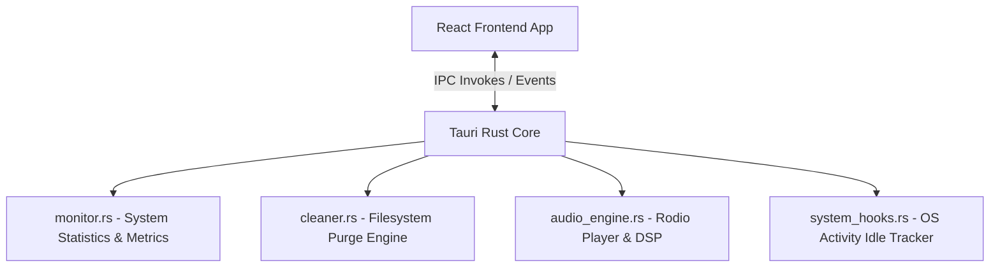

# 🚀 DeskWell Systems & Security Bot — Feature Inventory & Futuristic Roadmap

This document serves as the core technical index of the **DeskWell** desktop application. It outlines the current production features, underlying system workflows, and maps out highly feasible, advanced, and futuristic systems engineering extensions within the Rust and Tauri v2 ecosystem.

---

## 🛠️ Module 1: Current Feature Inventory & Architecture

DeskWell is built on **Tauri v2 (Rust Core)** and **React 19 + Tailwind CSS v4** in the frontend, coordinating a resource-light desktop footprint (< 40MB RAM).



### 1. 📊 System Diagnostics & Monitor (`monitor.rs`)
* **Real-Time KPI Tracking**: Polls CPU, RAM, and Storage partition metrics (mount paths, total vs available spaces) at 1-2s intervals via the `sysinfo` crate.
* **Network Speed Delta Monitor**: Tracks network adapter packet flow. Converts bytes delta dynamically into real-time bandwidth consumption:
  $$\text{Mbps} = \frac{((\text{Bytes}_{\text{new}} - \text{Bytes}_{\text{old}}) \times 8)}{1024 \times 1024 \times \text{DeltaTimeSeconds}}$$
* **Windows Thermal Sensor Zone Polling**: Reads core temperatures using WMI interfaces and hardware components, with a built-in safe default fallback to `45.0 °C` when sensor rings are locked behind non-elevated user contexts.
* **Process Manager**: Lists active OS processes (`get_running_processes`) and triggers process terminations (`kill_process`) using raw PID handles.

### 2. 🧹 Workspace Cleaner (`cleaner.rs`)
* **Dual-Mode Directory Scanning**:
  * **Target Workspace Mode**: Detects stale project folders (`node_modules`, `target`, `build`) and configuration dotfiles (`.env`).
  * **Target Files Mode**: Recursively scans directories up to a depth of 6 folders, grouping items by file extension categories (Markdown, Data, Documents, Visual, Media, Binaries).
* **High-Performance Background Purger**: Offloads bulk file unlinks and directory recursion (`remove_dir_all`) to a spawned thread (`tokio::spawn`) with a voluntary yielding model (`tokio::task::yield_now().await`) to ensure high-frequency IPC channels remain completely unblocked.
* **Premium Table Header Controls**: Displays interactive category selection chips directly within the table column headers, featuring category-specific Lucide icons. Checked filters instantly update the React rendering view via a local memoized selector.
* **Session Space Counter**: Tracks the cumulative session disk space reclaimed (`totalReclaimedBytes`), displaying it in the Space Reclaimed dashboard widget.

### 3. 🛡️ Security Auditor & Shield (`monitor.rs`)
* **Local Antivirus Scanner**: Scans directory targets for signature matches, with actions to quarantine, restore, delete, or flag suspicious objects.
* **Ports Auditor**: Queries open network sockets and lists process bindings (`get_listening_ports`), mapping process names to TCP/UDP ports.
* **Startup & Persistence Manager**: Scans boot registries (`get_startup_apps`) and detects autorun configurations or hidden registry startup hooks (`scan_startup_persistence`).

### 4. 🧠 Ergonomic Wellness & Idle Hooks (`system_hooks.rs`)
* **OS Activity Monitor**: Subscribes to native keyboard and mouse event states using Windows Win32 APIs (`GetLastInputInfo`) to calculate idle times in seconds.
* **Wellness Dashboard**: Includes a water hydration logger, step-counter progress indicators, and eye-break/stretch-break countdown timers.

### 5. 🎵 Spotify-Style Audio Engine (`audio_engine.rs`)
* **Rodio Output Pipeline**: Manages audio playback using the `rodio` audio interface and `symphonia` decoders.
* **Dolby Audio Enhancements**: Simulated soundscape equalizer features.
* **Playlist & Queue Management**: Supports shuffled queues, repeating tracks, liking tracks, and categorizing files by energy/focus moods.

---

## 🔄 Module 2: Core System Workflows

### 1. Close-to-HUD Window Transition Workflow
When a user clicks "Close" on the main window, the event is intercepted in `main.rs` to keep the process running:

```
[Main Window (Close Clicked)]
            │
            ▼
[Intercept WindowEvent::CloseRequested]
            │
            ▼
[Tauri: api.prevent_close()]
            │
            ▼
[window.emit("toggle-floating-bar", true)]
            │
            ▼
[React: Resize Frame to 360x60, set_decorations(false), set_always_on_top(true)]
            │
            ▼
[Compact Floating HUD Mode Active]
```

### 2. Non-Blocking Bulk Deletion Workflow
To prevent UI lockups when deleting 6,000+ files:

```
[React: deleteSelectedFiles()]
            │
            ▼
[Tauri IPC: invoke('delete_cleaner_items')]
            │
            ▼
[Rust: tokio::spawn thread loop] ──► [fs::remove_file / fs::remove_dir_all]
            │                                     │
            │ (after each item)                   ▼ (if success)
            ├────────────────────────── [Emit "deletion-progress" Event]
            │                                     │
            ▼ (yield to OS thread)                ▼
[tokio::task::yield_now().await]       [React: Update Log Strikethrough & progress]
```

---

## 🔮 Module 3: Futuristic Rust Extensions & Feasibility

### 1. 🌐 Live Network Packet Sniffer (Traffic Auditor)
* **Goal**: Real-time packet parsing to detect unexpected outgoing data connections or sudden bandwidth spikes per process.
* **Feasibility**: High. Using the `pcap` crate or `pnet` (Packet Network) crate to attach to the default network interface. 
* **Rust Implementation**:
  ```rust
  // Feasible background packet parsing loop
  use pcap::Capture;
  
  pub fn start_sniffer() {
      tokio::task::spawn_blocking(|| {
          let mut cap = Capture::from_device("npf_loopback")
              .unwrap()
              .immediate_mode(true)
              .open()
              .unwrap();
          while let Ok(packet) = cap.next_packet() {
              // Parse Ethernet / IP / TCP Headers
              let length = packet.header.len;
              // Emit stats to frontend
          }
      });
  }
  ```
* **Futuristic UX**: Overlapping flows showing bandwidth graphs per active executable name, flashing alerts if a process starts bulk transfers to unknown IPs.

### 2. 🔌 USB Device Insertion Monitor & Auto-Scan Shield
* **Goal**: Detect physical USB drive mounts in real-time, log insertion logs, and run auto-scans for malware.
* **Feasibility**: High. On Windows, this utilizes a hidden message-only window class subscribing to `WM_DEVICECHANGE` events or polling WMI `Win32_VolumeChangeEvent`.
* **Rust Implementation**:
  Use the WMI crate or Win32 crate handles to capture volume arrivals:
  ```rust
  use windows::Win32::UI::WindowsAndMessaging::{WM_DEVICECHANGE, DBT_DEVICEARRIVAL};
  // Hook into Tauri's main loop window procedure to intercept device notifications
  ```
* **Futuristic UX**: A radial HUD warning popup appears: *"USB Drive Mounted (E:\) — running security sandbox scan..."*

### 3. ⚡ S.M.A.R.T. SSD/HDD Health Predictor
* **Goal**: Read disk drive S.M.A.R.T attributes (reallocated sectors, temperature, wear ranges) to predict failure rates.
* **Feasibility**: Medium-High. Requires elevated privileges to send `IOCTL_STORAGE_QUERY_PROPERTY` or query WMI namespaces (`root/wmi:MSStorageDriver_FailurePredictStatus`).
* **Rust Implementation**:
  ```rust
  // Querying wear level indicators via WMI FailurePredictStatus
  ```
* **Futuristic UX**: Glassmorphic disk ring indicators that pulse red if SSD wear levels drop below 80%.

### 4. 📋 Clipboard Shield & Sensitive Data Eraser
* **Goal**: Monitor the system clipboard for API keys, credit cards, or passwords, and automatically clear them after 30 seconds to prevent clipboard hijacking.
* **Feasibility**: High. Using the `clipboard-win` or `arboard` crate inside a spawned polling loop, matching against regex templates.
* **Rust Implementation**:
  ```rust
  use arboard::Clipboard;
  
  pub fn start_clipboard_monitor() {
      tokio::spawn(async {
          let mut clipboard = Clipboard::new().unwrap();
          let mut last_content = String::new();
          loop {
              if let Ok(text) = clipboard.get_text() {
                  if text != last_content {
                      if is_sensitive(&text) {
                          // Trigger Notification
                          // Wait 30s and clear
                      }
                      last_content = text;
                  }
              }
              tokio::time::sleep(Duration::from_millis(500)).await;
          }
      });
  }
  ```

### 5. 🔒 Sandbox File virtualization (Disposable File Sandbox)
* **Goal**: Let users open suspicious executable files inside a transient virtualized Windows Sandbox or micro-VM container.
* **Feasibility**: Medium. Command-line orchestrator that generates standard temporary `.wsb` (Windows Sandbox configuration) XML layouts and launches the native Windows Sandbox.
* **Rust Implementation**:
  Generate XML config setting folders to mount in read-only directories:
  ```rust
  std::fs::write("temp_sandbox.wsb", sandbox_xml_config)?;
  std::process::Command::new("cmd").args(&["/c", "start", "temp_sandbox.wsb"]).spawn()?;
  ```
* **Futuristic UX**: One-click "Launch in Sandbox" button in the security log details card.
